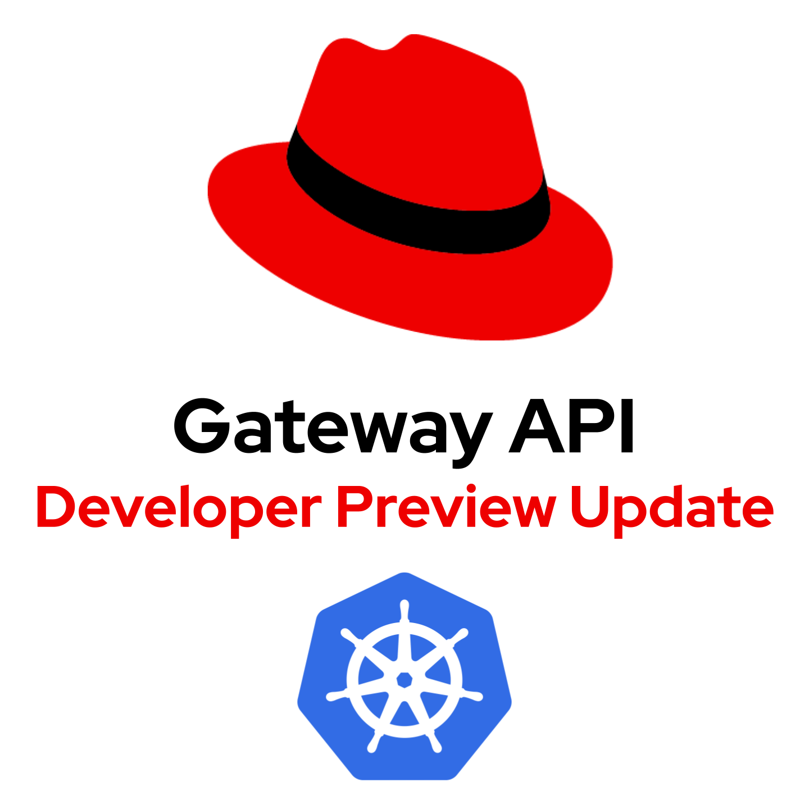

# Gateway API with OpenShift Networking - Developer Preview Update

Authors: Grant Spence

As a follow-on to the Openshift 4.12 Developer Preview of Gateway API, Red Hat has released an enhanced Developer
Preview for Gateway API support in OCP 4.13.5. If you haven't read our first blog post, [Introducing Gateway API with OpenShift Networking - Developer Preview](https://cloud.redhat.com/blog/introducing-gateway-api-with-openshift-networking-developer-preview),
which contains an overview of the Gateway API components, please take a minute to review it.

## New Features in Developer Preview

With this Developer Preview update, you can now install and configure the capability to use Gateway API with the Ingress
Operator, seamlessly installing all the necessary Gateway API components without any external downloads. By delegating
the responsibility of installation and configuration to the Ingress Operator, developers can now dedicate their focus to
exploring and leveraging the powerful API that Gateway API has to offer.

The Ingress Operator enables the use of Gateway API by:
* Installing version 0.5.1 Gateway API custom resource definitions (CRDs)
* Installing and configuring Istio as the Gateway API implementation via [OpenShift Service Mesh (OSSM)](https://docs.openshift.com/container-platform/4.13/service_mesh/v2x/ossm-about.html)
* Enabling creation of Load Balancers via Istio’s [automated deployments](https://istio.io/latest/docs/tasks/traffic-management/ingress/gateway-api/#automated-deployment)
* Automatically creating DNS Records for Gateways

These updates provide OpenShift developers with the opportunity to explore and utilize Gateway API using Red hat's
existing range of product offerings. By integrating the Ingress Operator with OpenShift Service Mesh, we are able to
offer this Developer Preview of Gateway API with our existing robust and security-focused Istio solution.

### Behind a Feature Gate

The features mentioned in this Developer Preview update are accessible through [OpenShift's feature gate mechanism](https://docs.openshift.com/container-platform/4.13/nodes/clusters/nodes-cluster-enabling-features.html).
By implementing Gateway API support under a feature gate, it is not activated by default, requiring users to explicitly
opt in to use it. The feature gate can be enabled by configuring the “CustomNoUpgrade” feature set, which means the
cluster will no longer be upgradable after enabling.

Only enable this feature on a non-production cluster. Once this feature gate is enabled, it can never be disabled.
Please note that, since feature gates are stored in the machine config, patching the feature gate config will result in
the machine config operator rebooting each node sequentially, according to your machine config pool configuration.

## Getting Started

[Instructions for getting started with Gateway API via the Ingress Operator](https://github.com/openshift/network-edge-tools/blob/main/docs/blogs/EnhancedDevPreviewGatewayAPI/GettingStarted.md)

## Getting Creative

[Instructions for more advanced capabilities using Gateway API](https://github.com/openshift/network-edge-tools/blob/main/docs/blogs/EnhancedDevPreviewGatewayAPI/GettingCreative.md)
