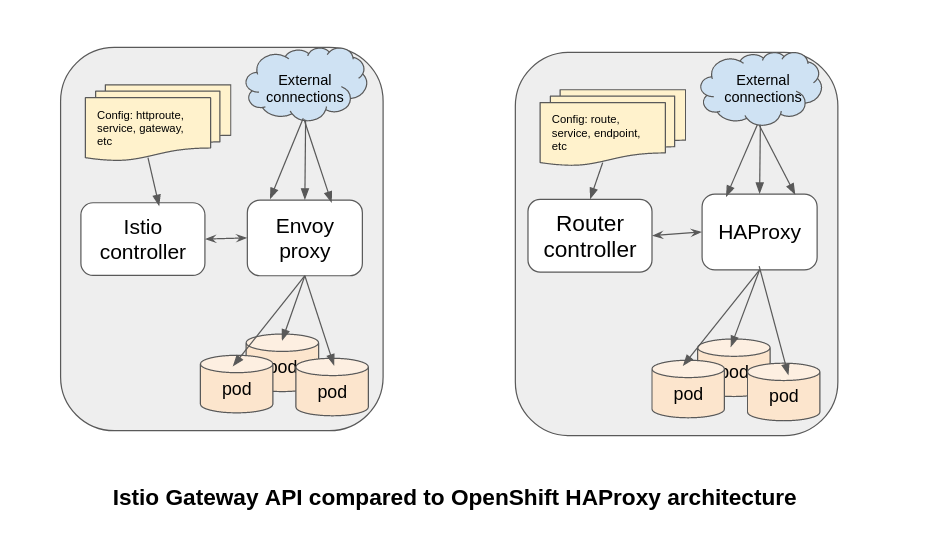
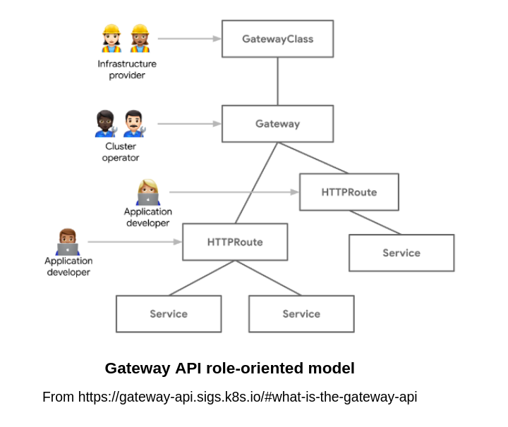
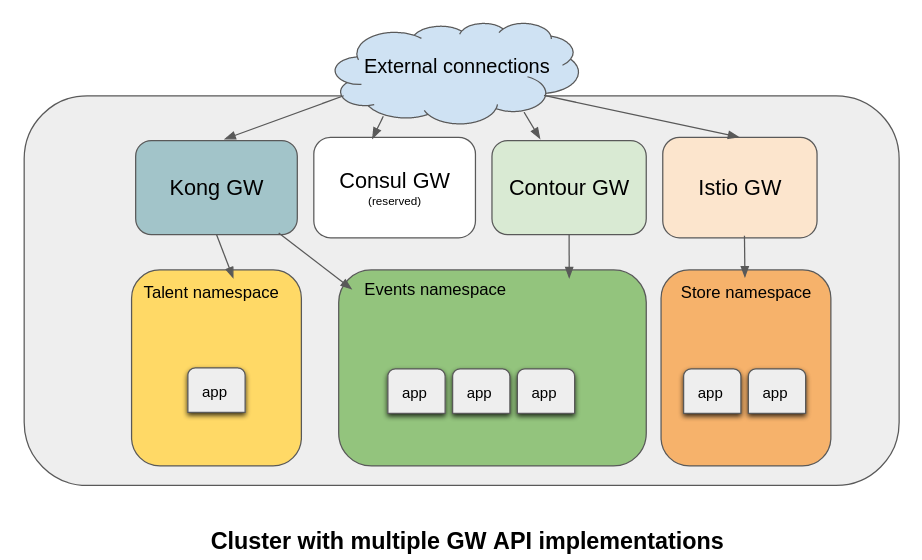

# Introducing Gateway API with OpenShift Networking - Developer Preview

Authors: Candace Holman, Grant Spence, and the OpenShift Network Edge Team


## What is Gateway API?
[Gateway API](https://gateway-api.sigs.k8s.io/) (GWAPI) is an open source, community managed, Kubernetes
service-networking mechanism, and has been adopted as the future service-networking API in implementations by a
[wide variety of vendors](https://gateway-api.sigs.k8s.io/implementations/).  It has been slated as an eventual
replacement for [OpenShift Ingress Routing](https://docs.openshift.com/container-platform/4.11/networking/configuring_ingress_cluster_traffic/overview-traffic.html),
and is offered as a Developer Preview feature in OpenShift 4.12.

OpenShift has had a cluster ingress solution since its first release, in order to support self-service of cluster ingress
by developers and namespace administrators.  Kubernetes later added the Ingress API specification, with many backing
implementations (including OpenShift).  However, the Ingress API left a lot to be specified by the implementation, making
it difficult to develop portable Ingress objects across implementations.  To address this, the Ingress v2 working group
was started, and Red Hat has been involved throughout.  This group evolved into what is today the
[Kubernetes Gateway API working group](https://gateway-api.sigs.k8s.io/contributing/community/), which continues to
garner robust community support.



### Gateway API Resources
The basic building blocks of the Gateway API are resources called HTTPRoute, Gateway, and GatewayClass.

 Resource | Definition | Relationships 
--------------|------------------------------------------------------------------------------------------|--------------
 HTTPRoute | Specifies rules for mapping requests from a Gateway to Kubernetes Services, especially for multiplexing HTTP or terminated HTTPS connections. | References Gateway/s 
 Gateway | Describes how traffic can be translated to Services within the cluster, e.g. a specific load balancer config. | Implements GatewayClass
 GatewayClass | Defines a set of Gateways that share a common configuration and behavior. | --

Shown below is an example of a HTTPRoute named `my-route` that is configured to attach only to the gateway named `example-gateway`
in the namespace `example-ns1`, and will not attach to any other Gateways.  Note that `parentRefs` refer to the gateway and
`backendRefs` refer to service endpoints.

```yaml
apiVersion: gateway.networking.k8s.io/v1beta1
kind: HTTPRoute
metadata:
  name: my-route
  namespace: example-ns2
spec:
  parentRefs:
  - kind: Gateway
    name: example-gateway
    namespace: example-ns1
  rules:
  - backendRefs:
    - name: example-service
      port: 8080
```
The next example shows the Gateway `example-gateway`, configured to allow the `my-route` HTTPRoute to attach.  Note the
reference to `gatewayClassName`.

```yaml
apiVersion: gateway.networking.k8s.io/v1beta1
kind: Gateway
metadata:
  name: example-gateway
  namespace: example-ns1
spec:
  gatewayClassName: example-lb
  listeners:
  - name: prod-web
    port: 80
    protocol: HTTP
    allowedRoutes:
      kinds: 
        - kind: HTTPRoute
      namespaces:
        from: Selector
        selector:
          matchLabels:
            # This label is added automatically as of K8s 1.22
            # to all namespaces
            kubernetes.io/metadata.name: example-ns2
```

Finally, the example GatewayClass, `example-lb`:

```yaml
apiVersion: gateway.networking.k8s.io/v1beta1
kind: GatewayClass
metadata:
  name: example-lb
spec:
  controllerName: "example.net/gateway-controller"
  parametersRef:
    group: example.net/v1beta1
    kind: Config
    name: internet-gateway-config
---
apiVersion: example.net/v1alpha1
kind: Config
metadata:
  name: internet-gateway-config
spec:
  ip-address-pool: internet-vips
  ...
```
For more information on these resources, see an expanded discussion in [the Gateway API specification](https://gateway-api.sigs.k8s.io/api-types/gatewayclass/).

### Istio Ingress Gateway

OpenShift Networking will support Gateway API using [Istio Ingress Gateway](https://istio.io/latest/docs/tasks/traffic-management/ingress/gateway-api/).
The Istio implementation has been chosen by OpenShift as an exemplary Gateway API implementation, with its legacy of
thought leadership and its vibrant community.  Istio Ingress Gateway is only one facet of what [Istio Service Mesh](https://istio.io/latest/about/service-mesh/)
offers in the well-established [OpenShift Service Mesh (OSSM)](https://docs.openshift.com/container-platform/4.11/service_mesh/v2x/ossm-about.html#ossm-servicemesh-overview_ossm-about)
product line.  Having a tie to OSSM yields a healthy outlook,  consistent experience for users, and smoother integration
for customers who also want to use service mesh as a part of their service-networking configuration.

## Why use Gateway API?

Gateway API is focused on creating a well-designed, community-supported, and portable API.  It has been reviewed and implemented
by [a large community](https://gateway-api.sigs.k8s.io/implementations/), including several vendors, proving that the API
portability has significant appeal, enhances third-party integration, and reduces vendor lock-in.  Gateway API design is
expressive, incorporating a native feature framework that replaces the use of custom annotations in Ingress.  At the same
time, the design supports extensibility and the future of features through granular customization levels.  To simplify
operations, Gateway API design focuses on role-oriented API resources, allowing for role-based access to just-enough Kubernetes
details to satisfy and empower each organizational role.  Besides simplifying operations, role-oriented resource access
reduces costs by enabling the safe sharing of infrastructure without requiring shared control.



The key reason to use Gateway API with OpenShift Networking is that it enables the installation and use of multiple
third-party Gateway API implementations on the same cluster.  This allows infrastructure providers to offer a range of gateway
implementations for the benefit of cluster operators and application developers.  Also, as the standard implementations
converge, the same Gateway API compliant configuration can be used for two different implementations on the same cluster.



### Features offered in Dev Preview

In the Developer Preview we have chosen to provide the current version of Gateway API, 0.5.1, and the Istio release (1.15.1)
that incorporates it. This release includes the following features:

Feature | Definition
-------------------|---------------------------------------------------------------------------------------------
Path-based routing | Routes with different paths can have different destinations.|
Weighted backends for traffic splitting | [Traffic Splitting]( https://gateway-api.sigs.k8s.io/guides/traffic-splitting/?h=weight#http-traffic-splitting) via weight configuration placed on backends, e.g. split 50% on each of two backends.
Wildcard subdomain | Host names may be prefixed with a wildcard label (*.), which is interpreted as a suffix match.
Comprehensive route status | [Status overview](https://gateway-api.sigs.k8s.io/api-types/httproute/#routestatus) and [route conditions](https://gateway-api.sigs.k8s.io/references/spec/#gateway.networking.k8s.io%2fv1beta1.RouteConditionType) provide status and troubleshooting information on routes.
Proxy logs | `oc logs frontend-POD-ID -c istio-proxy`
Gateway logs | `oc logs gatewayname-POD-ID`
Istiod logs | `oc logs istiod-POD-ID`
Application logs| `oc logs app-name-POD-ID`
Troubleshooting |  Istio provides good troubleshooting documentation on [traffic management](https://istio.io/latest/docs/ops/common-problems/network-issues/) and [configuration validation](https://istio.io/latest/docs/ops/common-problems/validation/). Istio Service Mesh workshop shows a list of [istioctl commands](https://www.istioworkshop.io/12-debugging/01-istioctl-debug-command/) that help.  Envoy also provides [debugging](https://www.envoyproxy.io/docs/envoy/latest/faq/overview#debugging) tips.


## Getting Started

[Instructions for getting started with Gateway API](https://github.com/openshift/network-edge-tools/blob/main/docs/blogs/IntroGatewayAPI/GettingStarted.md)

## Getting Creative

[Instructions for more advanced capabilities using Gateway API](https://github.com/openshift/network-edge-tools/blob/main/docs/blogs/IntroGatewayAPI/GettingCreative.md)

## Conclusion

We hope you’ve enjoyed learning about Gateway API with OpenShift Networking.  If you have questions or feedback about
the Gateway API with OpenShift Networking Developer Preview, please drop us a line in the blog post
[Issues](https://github.com/openshift/network-edge-tools/issues) section.
